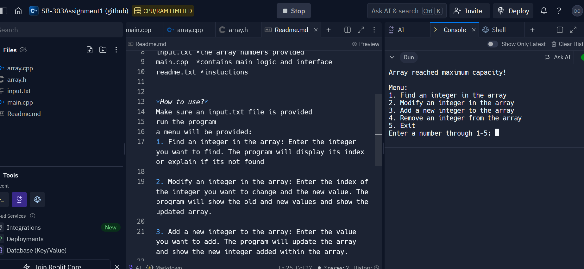
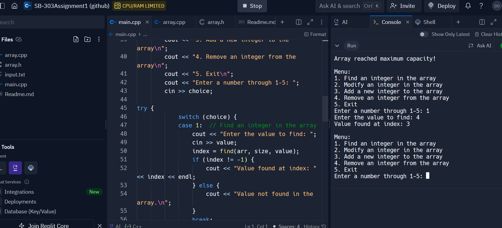
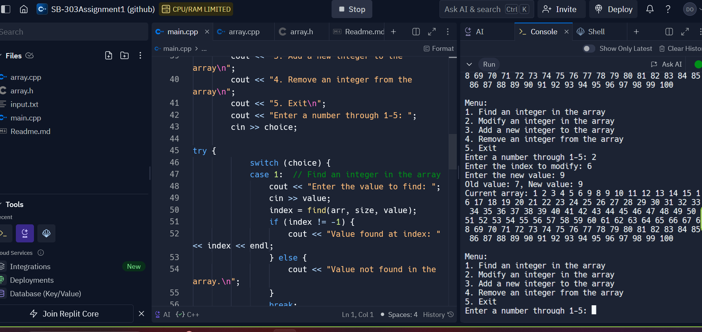
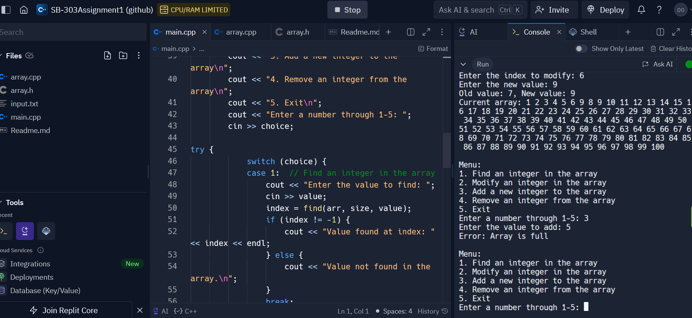
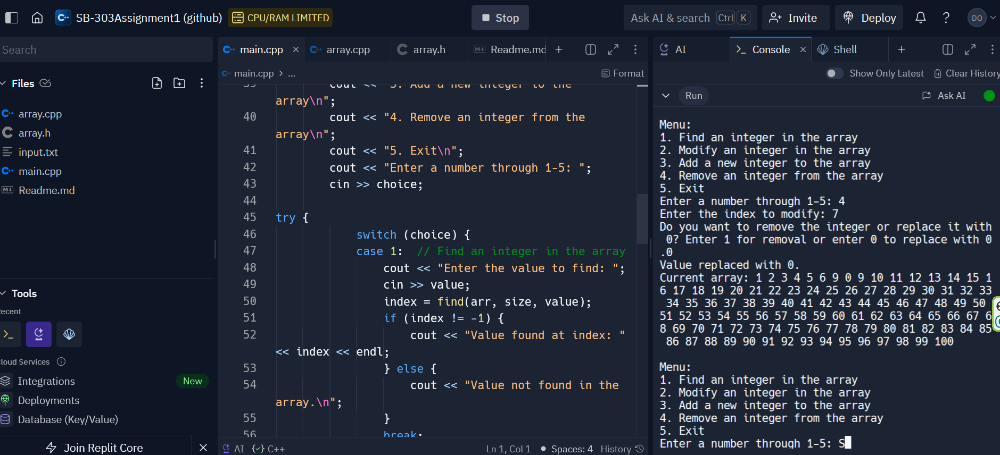
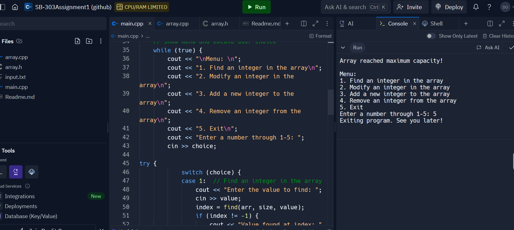

*******Read me ********

This c++ program is meant to read the input.txt file and allow the user(you) to manipulate the array within the file. Finding an integer, modifying an intger, add/removing an integer and being able to see the changes made to the array after.

The program consists of:
array.cpp * Implementations of array manipulation functions
array.h   *function declarations
input.txt *the array numbers provided
main.cpp  *contains main logic and interface
readme.txt *instuctions

*How to use?*
Make sure an input.txt file is provided
run the program
a menu will be provided:
1. Find an integer in the array: Enter the integer you want to find. The program will display its index or explain if its not found

2. Modify an integer in the array: Enter the index of the integer you want to change and the new value. The program will show the old and new values and show the updated array.

3. Add a new integer to the array: Enter the value you want to add. The program will update the array and show the new integer added within the array.

4. Remove or replace an integer from the array: Enter the index of the integer you want to change. You will be asked if you want to remove the element (shift left) or replace it with 0. The program will show the updated array.

5. Exit: Exit the program.

